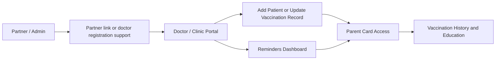

# Platform Overview and Role Map

## 1. Title
Platform Overview and Role Map

## 2. Document Purpose
Orient trainers, internal teams, and new stakeholders to the product’s end-to-end operating model before they dive into role-specific workflows.

## 3. Primary User
Internal trainers, product owners, partner leads, and new project team members

## 4. Entry Point
Public home page `/` plus direct workflow URLs for parents, doctors, and partners

## 5. Workflow Summary
The product is a pediatric vaccination system connecting partner onboarding, doctor registration, patient record management, parent self-service, reminders, and education content. The live app currently starts from a doctor/admin-oriented home page, while parent flows start from direct routes such as `/add/` and `/update/`.

## 6. Step-By-Step Instructions

### Step 1. Open the live landing page
- What the user does: Open the public home page in a browser.
- What the user sees: A simple landing page with Doctor Registration and Field Partner (Admin) actions.
- Why the step matters: This establishes the real starting point the product exposes today.
- Expected result: The trainer can explain that the live landing page is provider/admin oriented.
- Common issues or trainer notes: Call out that this differs from the original expectation of a parent-first landing page.
- Screenshot placeholder section:
  - Suggested file path: `docs/product-user-flows/assets/platform-overview-and-role-map/01-home-overview.png`
  - Screenshot caption: Live home page showing the current public entry points
  - What the screenshot should show: The home page with the doctor registration and admin actions visible.

### Step 2. Map each role to its real entry point
- What the user does: Review the product with role-based starting URLs: admin/partner, doctor, and parent.
- What the user sees: A product where some roles start from the home page and others start from direct routes or shared links.
- Why the step matters: Role clarity prevents confusion during onboarding and training delivery.
- Expected result: Users understand that parents, doctors, and partner/admin users do not all start from the same page.
- Common issues or trainer notes: Parent flows are best demonstrated from `/add/`, `/update/`, or a share link.
- Screenshot placeholder section:
  - Suggested file path: `docs/product-user-flows/assets/platform-overview-and-role-map/01-home-overview.png`
  - Screenshot caption: Home page reused as the anchor for the role-entry explanation
  - What the screenshot should show: The live landing page while the trainer overlays the role map verbally or in the deck.

### Step 3. Explain the end-to-end handoff chain
- What the user does: Walk through how partner setup enables doctor onboarding, which then enables patient registration, reminders, and parent access.
- What the user sees: A connected service flow rather than isolated screens.
- Why the step matters: This is the mental model that makes the rest of the workflow pack coherent.
- Expected result: The trainer can position each detailed workflow deck inside one shared operating model.
- Common issues or trainer notes: Use the role map slide in the deck for this step; there is no single live UI screen for the whole chain.
- Screenshot placeholder section:
  - Suggested file path: `docs/product-user-flows/assets/platform-overview-and-role-map/02-role-map-diagram.png`
  - Screenshot caption: Role map diagram for the end-to-end service flow
  - What the screenshot should show: A simple visual showing partner/admin -> doctor/clinic -> parent/patient progression.

## 7. Success Criteria
- The trainer can explain which role enters at which route.
- The audience understands how partner setup, doctor usage, parent access, reminders, and education fit together.
- Known live-product mismatches are called out before role training begins.

## 8. Related Documents
- [02-admin-partner-provisioning-and-field-rep-upload.md](02-admin-partner-provisioning-and-field-rep-upload.md)
- [03-doctor-self-registration-and-portal-access.md](03-doctor-self-registration-and-portal-access.md)
- [08-parent-self-service-card-history-and-share-link.md](08-parent-self-service-card-history-and-share-link.md)

## 9. Status
Validated against the local demo build on April 9, 2026. Documentation reflects live behavior; mismatches with older expectations are noted.
